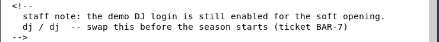

# Beach Bar

Time: 60 minutes

Difficulty: Easy

## What is about?

This challenge is all about expliting vulnerabilities on an application, we need to have access to the user and root to finish this challenge.

## Challenge

First I started with a nmap to map all the ports that are being use. After this I got that they are using 2 services ssh and http in their respective ports. I enter the web and it is an application to execute playlists, however I first need to log in to access the application. If we use curl to this page we notice a comment that tells that we have a username `dj` with the password `dj`, so I used this credentials to enter and it worked.

 

--WORKING--

## Conclusion