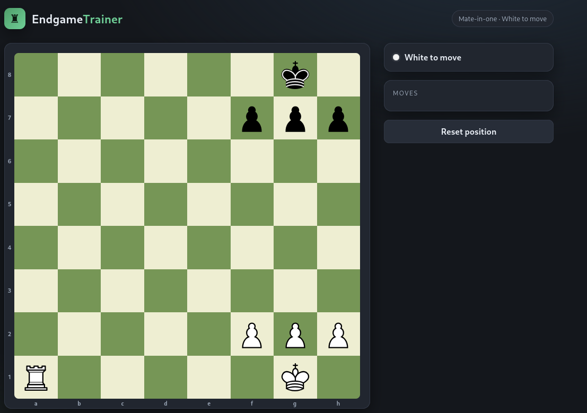

# Fools Mate ♟️

Time: 15 minutes

Difficulty: Easy

## What is about?

This challenges redirected you to a page where you can play chess. If you try to win by doing a checkmate the engine stop you before you can do it. The goal is to try and win the match.

 

## Vulnerability

When we do a `curl` to the page we can see the script something that needs to be hidden. If we now go to this new page we can see all the code to make work the chess. This page is the `js/app.js`. We continue to go function by function until we encounter what api post the movement of the chess piece. 

With this new information we just need to make a post with the intended movement. The command for doing this is `curl -X POST -H "Content-Type: application/json" -d '{"from":"a1","to":"a8"}' http://IP_MACHINE/api/move`. This command will do a checkmate with the rock in one move and the page will give you the Flag which is `THM{cl13nt_s1d3_ch3ckm4t3}`

## Conclusion
A very easy challenge that just need a little knowledge of webs and how to use the command curl. 
