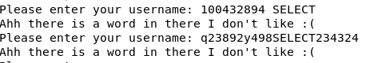
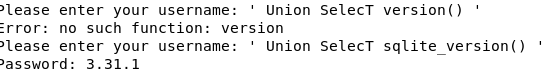
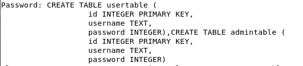

# Light

Time: 60 minutes

Difficulty: Easy

## What is about?

This challenge have an SQL DataBase to test my skills of SQL Injection. The challenge just say the port and how to connect to it with a username. 

## Challenge

We start just writting the name that the challenge tould us and it returned a password. I tried to enter the MACHINE by ssh but did not work. 

Now we are going to start the SQL Injection. First we start just just trying with comments `--`, but the SQL does not let any type of input that could make comment the SQL. For the second attempt we try with `'` and have an error but of the SQL, so we are going the right way. I tried to do `155' OR '1'='1` to see if it accept this type of injection and it does, becasuse it gave me other password but that did not help me.

In order to this challenge we need to make the `SELECT` work. If we just try to make a `SELECT` with all capitals the SQL is going to tell us that it do not like it. However if we alternate beteewn capitals and lowercase letters the SQL do not detect the `sElECT` so we are going to do that with every command that we have on SQL.  

 

Now we need to find what SQL is, to do that I tried every command to show the version of know popular SQLs and find out that it is a SQLite. With that information we seek on the internet to know about some command that give us the names of the tables and we found that we can do `' UnioN SelecT group_concat(sql) FrOm sqlite_master '`

 

We see in the image two tables, one is usertable and other admintable. So we direct or attention to the admintable and we write the next command `' UnioN SelecT group_concat(username) FrOm admintable '` and `' UnioN SelecT group_concat(password) FrOm admintable '`. And we got the username, password and flag. 

 

## Conclusion

This challenge was good, it was not easy nor difficult, it was entertaining. However if I did not study SQL before, it may became more confusing. The thing that took me the long time to know it was about group_concat becasuse I did not know how to utilize it and more larger sentence resulted on errors. It was my first time doing some SQL Injection but it was not that difficult if you know about SQL.